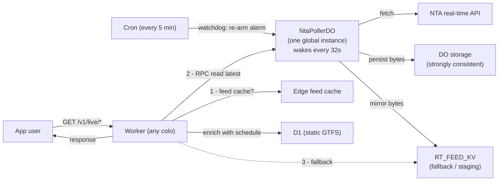

# nta-server-worker

A Cloudflare Worker that proxies [NTA GTFS-Realtime](https://developer.nationaltransport.ie/api-details#api=gtfsr) feeds and serves static GTFS schedule data from a D1 database.

---

## Overview

| Layer | What it does |
|---|---|
| **Live vehicles** (`GET /v1/live/vehicles`) | All active vehicles with real-time positions, enriched with route and headsign from static GTFS. Cached at the CF edge per 32 s slot. |
| **Trip details** (`GET /v1/live/trips/:trip_id`) | Full trip info: static route/stops/shape plus real-time stop delays. Cached per trip for ~65 s. |
| **Stop schedule** (`GET /v1/live/stops/:stop_id`) | Today's scheduled arrivals at a stop, enriched with real-time delays. Cached per stop for 2 min. |
| **Static stops** (`GET /v1/static/stops`) | All stops from the static feed. Cached until the static data version changes. |
| **Static version** (`GET /v1/static/version`) | Current static data version, so clients know when to re-fetch heavy static endpoints. |
| **Session init** (`POST /init`) | Issues a short-lived JWT for authenticating subsequent API requests. |

Requests are routed in `src/index.ts` via [Hono](https://hono.dev/).

---

## Architecture

### The problem

NTA's real-time feeds have a strict rate limit: **one request every 60 seconds per API key**. We have two keys. But a Cloudflare Worker doesn't run as one program — it runs as many independent copies, one in each Cloudflare data centre ("colo") around the world. If every copy fetched NTA on its own, dozens of data centres would each burn through the limit at once, and NTA would start rejecting us.

So we need **one single thing, globally, that talks to NTA** — and everything else reads what that one thing fetched.

### The solution: one global poller, read directly



**The poller** (`NtaPollerDO`, a [Durable Object](https://developers.cloudflare.com/durable-objects/)) exists as exactly **one instance in the entire world**. It wakes itself every 32 seconds (an "alarm"), fetches the latest feed from NTA, and persists the raw bytes to its own strongly-consistent storage. A cron trigger every 5 minutes is only a watchdog that re-arms the alarm if it ever stops.

**The request handlers** never call NTA. They read the freshest bytes **directly from the poller DO** over RPC, enrich them with schedule data from D1, and respond. This keeps NTA traffic to exactly one set of calls globally, no matter how many users or data centres are involved.

#### Why read from the DO and not from KV?

The obvious design is "poller writes to KV, handlers read from KV". We started there, and it produced a subtle bug: **clients saw the same data — and the same `X-Last-Update-At` — for up to ~60 seconds**, even though the poller publishes every 32 s.

The cause is KV's consistency model. KV is *eventually* consistent: once a colo reads a key, it caches that value (and its metadata) in-region for up to ~60 seconds, and newer writes from the poller stay invisible there until that cache expires. No `cacheTtl` setting fixes this — the minimum is 30 s and cross-region propagation is "up to 60 s". KV simply cannot deliver 32-second read freshness.

A Durable Object **is** strongly consistent, so reading the latest bytes from it is always fresh. To keep the DO off the hot path we put a short **feed-level edge cache** in front of it (one entry per feed per colo per slot), so the whole fleet makes at most ~one RPC per colo per slot regardless of request volume. KV is kept only as a fallback (a DO that is cold right after eviction) and as the **sole feed source for the staging Worker**, which binds no poller DO of its own.

> The poller persists to **DO storage**, not just an in-memory field, on purpose: a Durable Object is evicted from memory between its 32 s alarms, which would wipe an in-memory cache and send reads back to the stale KV path. DO storage survives eviction and stays strongly consistent (feeds are well under the 2 MB per-value limit).

### The polling schedule

The poller runs on a repeating **128-second cycle, split into four 32-second slots**, alternating the two API keys:

| Slot | Time | NTA call | API key |
|---|---|---|---|
| 0 | 0 s | `/Vehicles` | KEY&nbsp;1 |
| 1 | 32 s | `/Vehicles` | KEY&nbsp;2 |
| 2 | 64 s | `/Vehicles` | KEY&nbsp;1 |
| 3 | 96 s | `/TripUpdates` | KEY&nbsp;2 |

Each key is used once every 64 seconds — a **4-second nominal margin** over NTA's 60-second limit (the real margin is larger, since HTTP dispatch latency stacks on top of the wall-clock reuse interval). Vehicle positions refresh every 32 s (with one 64 s gap per cycle, because slot 3 fetches trip updates instead); trip delays refresh every 128 s.

### Sequence of events

**On first deploy (cold start):**

1. `wrangler deploy` uploads the Worker and registers the `NtaPollerDO` class + cron. Nothing polls yet — `RT_FEED_KV` is empty.
2. Within 5 minutes the cron fires and calls `NtaPollerDO.start()`, which sets the first alarm. (Deploying does **not** start the poller; only the cron does.)
3. The alarm fires on the next 32 s boundary and the self-sustaining loop begins.

**Steady-state poll (every 32 s):**

1. The platform invokes `NtaPollerDO.alarm()`.
2. `poll()` works out the current slot (0–3) and fetches the matching NTA feed with the matching key, with a **10 s fetch timeout**.
3. On success it stamps metadata (`nextUpdateAt`, `lastUpdateAt = now`), persists the raw bytes + metadata to **DO storage** (the request path's source of truth), and mirrors them to `RT_FEED_KV` (600 s TTL) for the fallback/staging path. On failure it logs and skips — the previous bytes stay live.
4. In a `finally` block it schedules the next alarm for the next 32 s boundary. This self-reschedule is what keeps the loop alive; the cron is only a fallback.

**Steady-state user request (`GET /v1/live/*`):**

1. The Worker (in whatever colo serves the user) checks its local **enriched-response edge cache** first. On a hit it returns the cached gzipped protobuf immediately — no DO, KV, or D1 work.
2. On a miss it fetches the raw feed via `NtaClient`, which reads newest-source-first: a short-lived **feed-level edge cache**, then the **poller DO over RPC** (strongly consistent), then **KV** as a fallback. It then enriches with D1, gzips, stores the enriched response in the edge cache, and returns it.
3. Every live response carries the two freshness headers below. If no source has data yet (pre-first-poll), it returns a graceful "data unavailable" response instead of an error.

### Freshness headers

Every `/v1/live/*` response advertises when its data was produced and when it will next change, so clients can poll efficiently instead of guessing:

| Header | Meaning |
|---|---|
| `X-Last-Update-At` | Epoch-ms of the last successful poll behind this data. |
| `X-Next-Update-At` | Epoch-ms when fresh data is next expected. Clamped to at least now + one slot so a stalled poller can't advertise a past instant. |

`Cache-Control: max-age` is aligned to `X-Next-Update-At`, so HTTP freshness and the advertised hint always agree. A client should re-fetch at `X-Next-Update-At`; if two consecutive responses share the same `X-Last-Update-At`, the upstream feed genuinely hasn't changed yet.

### Caching layers

1. **Enriched-response edge cache** — each handler caches its final enriched response (protobuf, gzipped) at the local colo, keyed by the current slot/epoch, so repeat requests within the slot skip all downstream work.
2. **Feed-level edge cache** — the raw decoded feed, cached per colo per slot in front of the poller DO. It collapses many enriched-cache misses (especially per-trip and per-stop ones) into at most one DO read per colo per slot.
3. **Poller DO storage** — the strongly-consistent source of truth the request path reads over RPC. Refreshed every slot; survives DO eviction.
4. **`RT_FEED_KV`** — a fallback mirror of the raw feeds (600 s TTL). Used when the DO is cold immediately after eviction, and as the only feed source on staging.

### Timeouts &amp; cache TTLs reference

Every tunable timeout and cache lifetime in one place:

| Setting | Value | Where | Purpose |
|---|---|---|---|
| Poller slot | 32 s | `SLOT_MS` (`nta-client.ts`) | How often the poller wakes |
| Poller cycle | 128 s | `SLOT_MS × CYCLE_SLOTS` | Full Vehicles×3 + TripUpdates×1 rotation |
| Token reuse interval | 64 s | derived | Each API key reused every 2 slots (4 s margin) |
| NTA fetch timeout | 10 s | `FETCH_TIMEOUT_MS` (`nta-poller.ts`) | Aborts a slow NTA subrequest |
| `RT_FEED_KV` TTL | 600 s | `FEED_KV_TTL` (`nta-poller.ts`) | Raw feed bytes survive transient poll failures |
| Cron watchdog | every 5 min | `triggers.crons` (`wrangler.jsonc`) | Re-arms the alarm only if missing |
| Vehicles edge cache | 34 s | `VEHICLE_CACHE_TTL` (`nta-client.ts`) | `/v1/live/vehicles` response cache (aligned to next refresh) |
| Vehicles feed cache | 34 s | `VEHICLES_FEED_CACHE_TTL` (`nta-client.ts`) | Raw Vehicles feed cached in front of the poller DO |
| TripUpdates feed cache | 130 s | `TRIPUPDATES_FEED_CACHE_TTL` (`nta-client.ts`) | Raw TripUpdates feed cached in front of the poller DO |
| Trip edge cache | 65 s | `CACHE_TTL` (`trip.ts`) | `/v1/live/trips/:id` response cache |
| Stop schedule edge cache | 120 s | `CACHE_TTL` (`stop-schedule.ts`) | `/v1/live/stops/:id` response cache |
| Static stops cache | 300 s | `max-age` (`stops.ts`) | `/v1/static/stops` response cache |
| Static version cache | 60 s | `max-age` (`static-version.ts`) | `/v1/static/version` response cache |
| HMAC replay window | 30 s | `init.ts` | Rejects `/init` requests with stale timestamps |
| JWT expiry | 3600 s (1 h) | `init.ts` | Session token lifetime |
| `/init` rate limit | 120 / h / IP | `index.ts` | Per-IP cap on token issuance |
| `/v1/*` rate limit | 600 / 5 min / token | `index.ts` | Per-token request cap |

### Cold start

Right after a fresh deploy, the poller's storage and `RT_FEED_KV` are both empty until the first poll runs (up to ~5 minutes, when the cron first fires and bootstraps the alarm). During that brief window the live endpoints return a graceful "data unavailable" response rather than an error.

---

## Prerequisites

- Node.js ≥ 22 (Wrangler requires it)
- A [Cloudflare account](https://dash.cloudflare.com/) with Workers, D1, KV, and Durable Objects enabled
- An NTA API key from the [NTA Developer Portal](https://developer.nationaltransport.ie/)

---

## Setup

### 1. Install dependencies

```bash
npm install
```

### 2. Create the KV namespaces

```bash
npx wrangler kv namespace create RATE_LIMIT_KV    # rate-limit buckets
npx wrangler kv namespace create STATIC_META_KV   # static GTFS version marker
npx wrangler kv namespace create RT_FEED_KV        # live NTA feed bytes (written by the poller)
```

Copy each returned `id` into the matching `kv_namespaces` entry in `wrangler.jsonc` (in **both** the top-level and `env.staging` blocks).

### 3. Set secrets

```bash
npx wrangler secret put NTA_API_KEY_1   # NTA API key (primary)
npx wrangler secret put NTA_API_KEY_2   # NTA API key (secondary/fallback)
npx wrangler secret put HMAC_SECRET     # Shared secret embedded in the mobile app
npx wrangler secret put JWT_SECRET      # Worker-side secret for signing session JWTs
```

See `scripts/setup-secrets.sh` for guidance on generating secure values for `HMAC_SECRET` and `JWT_SECRET`.

### 4. Create the D1 database

```bash
npx wrangler d1 create nta-static
```

Copy the returned `database_id` into `wrangler.jsonc` under `d1_databases[0].database_id`.

### 5. Apply the schema migration

```bash
npx wrangler d1 execute nta-static --remote --file=migrations/0001_gtfs_static.sql
```

> The `NtaPollerDO` Durable Object and its cron watchdog are configured in `wrangler.jsonc` and are created automatically on first `wrangler deploy` — no manual setup needed.

---

## Development

```bash
npm run dev        # local dev server (wrangler dev)
npm test           # run tests (vitest)
npm run cf-typegen # regenerate worker-configuration.d.ts after binding changes
```

---

## Deployment

```bash
npm run deploy
# or use the deploy script directly:
bash scripts/deploy.sh
```

---

## Security

Three layers of protection prevent abuse from bots, scrapers, and unauthorised API consumers without adding any friction for real users.

### 1. HMAC request signing (`POST /init` only)

The mobile app signs every `/init` request with a shared secret (`HMAC_SECRET`) using HMAC-SHA256. The signature covers the HTTP method, path, and a Unix timestamp (`X-Timestamp` header), and is sent as `X-Signature` (base64).

The Worker verifies the signature and **rejects any request with a timestamp older than 30 seconds** to prevent replay attacks. Requests that fail verification receive a `401`.

> Note: the shared secret is embedded in the app binary. This stops casual scraping but a motivated attacker with a decompiler could extract it. It is obfuscation, not authentication.

### 2. Short-lived JWT session tokens

On a successful `/init`, the Worker issues a signed JWT (HS256, 1 hour expiry) containing a unique `jti` claim. All subsequent API calls must include this token as a `Bearer` token in the `Authorization` header. The `jwt()` Hono middleware validates the token on every `/v1/*` request — invalid or expired tokens receive a `401`.

### 3. Rate limiting

| Endpoint | Key | Limit |
|---|---|---|
| `POST /init` | IP (`CF-Connecting-IP`) | 120 requests / IP / hour |
| `GET /v1/*` | Token identity (`jti`) | 600 requests / token / 5 min (≈ 120/min) |

IP-based limiting on `/init` is set generously to accommodate users behind NAT or mobile carrier CGNAT. The `/v1/*` routes are limited per token rather than per IP — each session has its own independent bucket, so users sharing an IP cannot affect each other.

Rate limit state is stored in the `RATE_LIMIT_KV` KV namespace.

---

## API endpoints

All `/v1/*` endpoints require a valid JWT in the `Authorization: Bearer <token>` header (obtained from `POST /init`).

### `POST /init`

Issues a session token. No `Authorization` header required, but the request must be HMAC-signed.

**Required headers:**

| Header | Value |
|---|---|
| `X-Timestamp` | Unix timestamp (seconds) |
| `X-Signature` | HMAC-SHA256 of `method + pathname + timestamp`, base64-encoded |

**Response:**
```json
{ "token": "<jwt>" }
```

---

### `GET /v1/live/vehicles`

Returns all active vehicles with real-time positions, enriched with `route_short_name` and `trip_headsign` from static GTFS.

**Accepted formats** (`Accept` header):
- `application/x-protobuf` — binary protobuf
- `application/json` — JSON (only when `ENABLE_JSON=true`)

Responses are cached at the edge until the next refresh (~32 s) and carry `X-Next-Update-At` / `X-Last-Update-At` freshness headers.

---

### `GET /v1/live/trips/:trip_id`

Returns full trip details: static route info, stop list with arrival/departure times, shape polyline, and real-time stop delays.

**Response shape (JSON):**
```json
{
  "tripId": "5675_85",
  "tripHeadsign": "Edenderry Town Hall",
  "routeShortName": "120",
  "routeLongName": "Dublin - Edenderry",
  "routeType": 3,
  "agencyName": "Go-Ahead Ireland",
  "shape": [{ "lat": 53.3498, "lon": -6.249, "distTraveled": 0 }],
  "stops": [
    {
      "stopSequence": 1,
      "stopId": "8340B355121",
      "stopName": "Dublin, Busáras",
      "arrivalTime": "14:00:00",
      "arrivalDelay": 120,
      "departureDelay": 120
    }
  ]
}
```

Responses are cached per `trip_id` until the next trip-updates refresh (≤ ~65 s) and carry `X-Next-Update-At` / `X-Last-Update-At` freshness headers.

---

## Static GTFS data

The static schedule data comes from NTA's `GTFS_Realtime.zip`, loaded into a Cloudflare D1 database (`nta_static`). It should be refreshed periodically (e.g. daily).

### Tables

| Table | Source file | Contents |
|---|---|---|
| `agency` | agency.txt | Operator names and URLs |
| `routes` | routes.txt | Route definitions |
| `calendar` | calendar.txt | Service patterns by day of week |
| `calendar_dates` | calendar_dates.txt | Service exceptions |
| `shapes` | shapes.txt | Route geometry (lat/lon sequences) |
| `stops` | stops.txt | Stop locations |
| `trips` | trips.txt | Trips per route/service |
| `stop_times` | stop_times.txt | Arrival/departure times per stop (~4 M rows) |

### Refreshing the static data

Run the publish script — it handles download, SQL generation, diff detection, and D1 import interactively:

```bash
bash scripts/gtfs/publish.sh
```

See the [Scripts section](#scripts) for a full breakdown of how it works, and [scripts/gtfs/explanation.md](scripts/gtfs/explanation.md) for a detailed explanation of the diff algorithm and the shape-rename optimisation.

---

## Protobuf type generation

The GTFS-Realtime protobuf types in `src/generated/` are generated from `res/gtfs-realtime.proto`:

```bash
npm run proto
```

Requires `protoc` to be installed (`brew install protobuf` on macOS).

---

## Scripts

All scripts live in `scripts/`. Run them from the project root.

### `scripts/deploy.sh`

Thin wrapper around `npm run deploy` with coloured output. Equivalent to running `npm run deploy` directly.

```bash
bash scripts/deploy.sh
```

---

### `scripts/generate-proto.sh`

Generates TypeScript types from `res/gtfs-realtime.proto` into `src/generated/res/gtfs-realtime.ts`. Wraps `npm run proto`.

Requires `protoc`:
```bash
brew install protobuf   # macOS
```

```bash
bash scripts/generate-proto.sh
```

---

### `scripts/setup-secrets.sh`

**Reference only — do not execute directly.** Contains step-by-step commands for generating and uploading `HMAC_SECRET` and `JWT_SECRET` to Cloudflare. Open it and run the commands manually, one at a time, so secrets are pasted interactively and never appear in shell history.

---

### `scripts/gtfs/publish.sh` _(recommended)_

End-to-end script to refresh the static GTFS data in D1. Before running, edit the two variables at the top of the file:

```bash
export CLOUDFLARE_ACCOUNT_ID="your-account-id"
export CLOUDFLARE_API_TOKEN="your-api-token"
```

The script will refuse to run if these are still set to the placeholder values.

```bash
bash scripts/gtfs/publish.sh
```

See [How `publish.sh` works](#how-publishsh-works) below for a detailed breakdown.

---

### `scripts/gtfs/print-stats.mjs`

Reads `.gtfs_stats.json` (written by `generate-sql.mjs`) and prints a per-table breakdown of upserts and deletes. Exits `0` if the feed version is unchanged (nothing to import), `1` if there are changes. Called by `publish.sh` — not normally run directly.

---

### How `publish.sh` works

The script runs in two steps with interactive confirmation between them.

**Step 1 — Download and generate SQL**

`generate-sql.mjs` is called with an increased Node.js heap. It runs in one of two modes depending on whether a previous import baseline exists:

| Mode | When | What it generates |
|---|---|---|
| **FULL** | First run (no `.gtfs_last_zip` file) | Loads all rows into shadow `*_new` tables, then atomically renames them to replace the live tables. Live data is never partially updated. |
| **DIFF** | Subsequent runs | Compares the new ZIP against the last successfully imported ZIP. Generates only `INSERT OR REPLACE` for new/changed rows and `DELETE` for removed rows. Much faster and smaller SQL file. |

The script writes three tracking files to the project root:

| File | Purpose |
|---|---|
| `.gtfs_stats.json` | Per-table row counts (upserts/deletes) used for the confirmation prompt |
| `.gtfs_pending_zip` | Path of the just-downloaded ZIP (not yet committed as baseline) |
| `.gtfs_last_zip` | Path of the last successfully imported ZIP (used as diff baseline next run) |
| `.gtfs_last_sql` | Path of the generated SQL file |

**Confirmation prompt**

After generation, `print-stats.mjs` prints a per-table breakdown:

```
  Mode : diff  (2026-06-01 → 2026-06-06)

  agency          (unchanged)
  routes          +12 upserts (1 stmts), -3 deletes (1 stmts)
  stop_times      +4,821 upserts (10 stmts), -190 deletes (1 stmts)
  ...

  Total : 5,103 upserts, 193 deletes → 14 SQL statements
```

If the feed version is unchanged, the script exits early with no import.

**Step 2 — Execute SQL against D1**

Runs `npx wrangler d1 execute` against the generated SQL file. Pass `--remote` flag by answering `y` to the "Publish to remote?" prompt at the start.

`wrangler d1 execute --file` wraps the entire file in a transaction automatically — no explicit `BEGIN`/`COMMIT` appears in the SQL (D1 forbids them).

After a successful import, `.gtfs_pending_zip` is promoted to `.gtfs_last_zip`, making the new ZIP the baseline for the next diff run. If the import fails, the baseline is not updated, so the next run will re-generate the full diff against the last known-good state.

---

## Project structure

```
src/
  index.ts                # Entry point — Hono router + cron watchdog + DO export
  env.d.ts                # Env interface extensions (secrets)
  durable-objects/
    nta-poller.ts         # NtaPollerDO — single global poller (NTA → RT_FEED_KV)
  handlers/
    init.ts               # POST /init — HMAC verification + JWT issuance
    vehicles.ts           # GET /v1/live/vehicles
    trip.ts               # GET /v1/live/trips/:trip_id
    stop-schedule.ts      # GET /v1/live/stops/:stop_id
    stops.ts              # GET /v1/static/stops
    static-version.ts     # GET /v1/static/version
  lib/
    nta-client.ts         # Reads live feeds from RT_FEED_KV; slot/cache-key math
    static-db.ts          # D1 static GTFS queries
    proto-cache.ts        # Edge-cache helper for gzipped protobuf
    compress.ts           # gzip / gunzip helpers
    kv-rate-limit-store.ts # KV-backed rate-limit store
    error-response.ts     # Standardised error responses
    static-version.ts     # Reads static data version from KV
  generated/
    res/
      gtfs-realtime.ts    # Auto-generated protobuf types
      nta.ts              # Auto-generated protobuf types
scripts/
  deploy.sh               # Deploy to Cloudflare
  generate-proto.sh       # Regenerate protobuf TypeScript types
  setup-secrets.sh        # Reference guide for creating Cloudflare secrets
  gtfs/
    publish.sh            # End-to-end static GTFS data refresh (download → SQL → D1)
    generate-sql.mjs      # Downloads GTFS ZIP and generates SQL import file
    print-stats.mjs       # Prints per-table diff breakdown from .gtfs_stats.json
migrations/
  0001_gtfs_static.sql    # D1 schema
res/
  gtfs-realtime.proto     # Protobuf definition
wrangler.jsonc            # Wrangler / Worker config (bindings, DO migration, cron)
```

